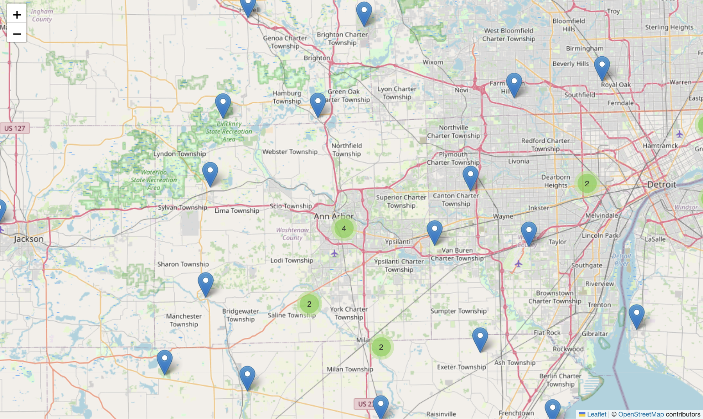

# NOAA_Climate-Patterns-Analysis-and-Visualization-2005-2015-

## Overview
This repository contains datasets and a Jupyter notebook with visualizations and analysis of temperature data from 2005 to 2015.

## Files
- **Analysis Report.pdf**: A PDF report summarizing the analysis findings.
- **NOAA_Climate Patterns Analysis and Visualization (2005-2015).ipynb**: The Jupyter notebook containing the analysis and visualizations.
- **map_image.png**: An image file showing the interactive map visualization.
- **station_map.html**: An html file showing the interactive map visualization. 
- **README.md**: This file.
  
## Dataset Source
The datasets is subset of a dataset from the National Centers for Environmental Information (NCEI) Daily Global Historical Climatology Network (GHCN-Daily), which provides daily climate records from land surface stations worldwide.

## Analysis
1. **Data Preparation**: Preprocessing and removal of leap days.
2. **Record High and Low Temperatures**: Line graph with shaded areas.
3. **Overlay 2015 Data**: Scatter plot for broken records in 2015.
4. **Map Visualization**: Interactive map of weather stations near Ann Arbor, Michigan.
   
5. **Temperature Summary for 2015**: Temperature summary for 2015.

## Additional Modules
- **`folium`**: For interactive maps.
- **`seaborn`**: For enhanced visualizations.

## Instructions
1. Open `NOAA_Climate Patterns Analysis and Visualization (2005-2015).ipynb`.
2. Run the notebook cells sequentially.

## Contact
For questions, contact [pradul2002@gmail.com].
